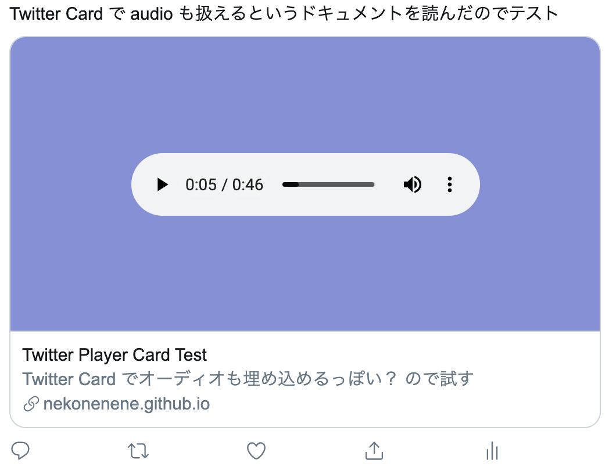

# Twitter Card Audio Player

[Twitter Card のドキュメント](https://developer.twitter.com/en/docs/tweets/optimize-with-cards/overview/player-card) を読んでいたら、  
誰でも Twitter 埋め込みプレイヤーを作れるっぽいことがわかって、「よっしゃ、試してみよう」とやったもの。

本当にできたのでびっくりしてる。

PC の Web ブラウザから Twitter を見るぶんには iframe がそのまま展開されるので見やすいけれど、  
スマホから見る場合は iframe の中身側のページに飛んでしまうので、  
Web Audio API を使うことでいい感じにプレイヤーのスタイルを整えて、遷移ボタンなども用意してあげたほうが良さそうだ。

